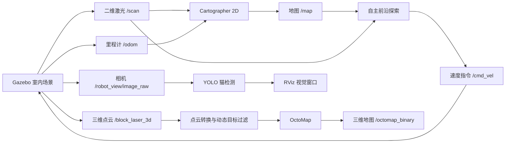

# 室内自主探索与三维建图仿真

基于 ROS Noetic、Gazebo 和 Cartographer 的室内机器人仿真项目。机器人在公寓场景中使用二维激光雷达完成定位和自主探索，同时可将三维激光点云构建为 OctoMap 三维占据地图；quick 场景还提供移动小猫动态障碍物和可选 YOLO 猫检测。

> 推荐运行模式：`slam_mode:=hybrid`。它使用稳定的二维 Cartographer 定位与建图，并将独立三维点云输入 OctoMap，适合地面机器人进行室内三维重建。

## 效果与功能

- **二维同步定位与建图（Simultaneous Localization and Mapping, SLAM）**：二维激光雷达和轮式里程计生成 `/map`。
- **自主探索**：`active_slam_explorer.py` 在已知自由区域中寻找前沿区域（已知空间与未知空间的边界），通过 Dijkstra 最短路径规划和局部激光避障驱动机器人覆盖房间、走廊和角落。
- **三维 OctoMap 重建**：在 hybrid 模式下，将模拟三维激光点云过滤、降采样后写入 `/octomap_binary`。
- **动态障碍物过滤**：quick 场景中的移动小猫会被三维点云过滤器排除，减少 OctoMap 中的动态残影。
- **视觉猫检测**：可选的 YOLO（You Only Look Once）检测器在相机图像中标出猫的边界框（bounding box, bbox）与置信度。
- **可视化**：RViz 显示二维地图、机器人、探索路径、目标点、三维体素与机器人视觉回传画面。

## 系统结构



## 仓库结构

```text
.
├── indoor_cartographer_demo/
│   ├── config/                 # Cartographer、costmap、DWA 配置
│   ├── launch/                 # ROS 启动文件
│   ├── media/                  # 小猫材质和纹理
│   ├── rviz/                   # 2D、3D、hybrid RViz 配置
│   ├── scripts/                # 探索、避障、点云、YOLO 等节点
│   ├── urdf/                   # 机器人模型与传感器配置
│   └── worlds/                 # detailed 与 quick Gazebo 场景
└── run_indoor_mapping_demo.sh  # 项目启动入口
```

## 环境要求

参考环境：Ubuntu 20.04、ROS Noetic、Gazebo 11、Python 3.8。

安装 ROS 和本项目使用的系统包：

```bash
sudo apt update
sudo apt install ros-noetic-desktop-full \
  ros-noetic-gazebo-ros \
  ros-noetic-octomap-ros \
  ros-noetic-octomap-server \
  ros-noetic-navigation \
  ros-noetic-explore-lite \
  ros-noetic-xacro \
  python3-catkin-tools python3-rosdep
```

安装可选视觉节点依赖：

```bash
python3 -m pip install --user numpy opencv-python ultralytics
```

## 安装 Cartographer

本仓库只包含室内仿真与算法配置，不包含 Cartographer 上游源码。启动脚本会依次查找以下工作空间：

```text
~/cartographer_ws
~/cartographer_ws_v3
~/cartographer_ws_v2
~/cartographer_ws_explorelite_stage
```

建议使用 `~/cartographer_ws`。若尚未安装，请创建一个 Catkin 工作空间并放入以下上游包：

```bash
mkdir -p ~/cartographer_ws/src
cd ~/cartographer_ws/src

git clone https://github.com/cartographer-project/cartographer.git
git clone https://github.com/cartographer-project/cartographer_ros.git
git clone https://github.com/cartographer-project/cartographer_ros_msgs.git
git clone https://github.com/cartographer-project/cartographer_rviz.git

cd ~/cartographer_ws
source /opt/ros/noetic/setup.bash
rosdep install --from-paths src --ignore-src --rosdistro noetic -r -y
catkin_make_isolated --install
```

完成后确认：

```bash
source ~/cartographer_ws/install_isolated/setup.bash
rospack find cartographer_ros
```

## 运行

克隆仓库：

```bash
git clone git@github.com:USTC-Astar/indoor_3d_mapping_slam.git
cd indoor_3d_mapping_slam
chmod +x run_indoor_mapping_demo.sh
```

### 1. 默认二维自主建图

```bash
./run_indoor_mapping_demo.sh
```

默认加载较完整的双卧室公寓场景。

### 2. quick 场景二维自主建图

```bash
./run_indoor_mapping_demo.sh scene:=quick
```

quick 场景面积较小，默认有一只移动小猫，适合快速验证探索、避障和视觉检测。

### 3. 推荐：hybrid 三维建图

```bash
./run_indoor_mapping_demo.sh scene:=quick slam_mode:=hybrid
```

该模式中，`/map` 仍是用于探索和导航的二维地图；三维占据地图通过 OctoMap 发布。RViz 中的 `/occupied_cells_vis_array` 显示三维体素。

### 4. 无图形界面运行

```bash
./run_indoor_mapping_demo.sh scene:=quick slam_mode:=hybrid gui:=false rviz:=false
```

### 5. 关闭自主探索或动态小猫

```bash
./run_indoor_mapping_demo.sh autonomous:=false
./run_indoor_mapping_demo.sh scene:=quick dynamic_obstacles:=false
```

## YOLO 猫检测

默认模型路径是：

```text
~/falconbot/src/falconbot_perception/models/yolov8n.pt
```

若模型不在该路径，指定本机权重文件：

```bash
./run_indoor_mapping_demo.sh \
  scene:=quick \
  slam_mode:=hybrid \
  yolo_model:=/absolute/path/to/yolov8n.pt
```

没有 YOLO 模型或不需要视觉检测时，关闭该节点即可：

```bash
./run_indoor_mapping_demo.sh scene:=quick yolo_cat_detector:=false
```

在 RViz 左下角的 `Robot View` 中，检测成功时会显示 `cat 0.xx` 和绿色 bbox；置信度阈值可通过 `yolo_confidence:=0.20` 调整。

## 关键话题

| 话题 | 类型/作用 |
| --- | --- |
| `/map` | Cartographer 生成的二维占据栅格地图 |
| `/scan` | 二维激光雷达数据 |
| `/cartographer/odom` | 过滤后的平面里程计 |
| `/active_slam/path` | 当前探索路径，RViz 中为黄色线 |
| `/active_slam/target` | 当前探索目标点 |
| `/active_slam/status` | 探索状态文本 |
| `/cmd_vel` | 机器人速度指令 |
| `/points2` | 过滤后的三维激光点云 |
| `/octomap/points_filtered` | 去除动态物体后的 OctoMap 输入点云 |
| `/octomap_binary` | OctoMap 二进制三维占据地图 |
| `/occupied_cells_vis_array` | RViz 三维体素可视化 |
| `/robot_view/yolo/image_annotated` | 含猫检测框和置信度的相机图像 |

检查运行状态：

```bash
rostopic echo -n1 /active_slam/status
rostopic echo -n1 /cmd_vel
rostopic echo -n1 /octomap_binary
```

## 自主探索逻辑

1. Cartographer 使用 `/scan` 和 `/cartographer/odom` 更新二维地图。
2. 探索器从 `/map` 找出“自由栅格邻接未知栅格”的前沿区域。
3. 对可达前沿进行代价评估：信息增益更大、路径更短、与当前目标更稳定的区域得分更高。
4. 使用 Dijkstra 算法在膨胀后的代价地图中生成无碰路径，并发布到 `/active_slam/path`。
5. 局部控制器利用实时激光数据选择安全朝向，避开墙体、家具和移动小猫。
6. 遇到堵塞或碰撞时，机器人执行刹车、后退、转向、重新规划和前沿黑名单恢复策略。
7. 当覆盖率、运行时间、行驶距离和地图增量满足完成条件时，机器人回到起点并结束轨迹。

## 主要参数

| 参数 | 默认值 | 说明 |
| --- | --- | --- |
| `scene` | `detailed` | `detailed` 为完整公寓，`quick` 为快速验证场景 |
| `slam_mode` | `2d` | 可选 `2d`、`3d`、`hybrid` |
| `autonomous` | `true` | 是否启用自主探索 |
| `dynamic_obstacles` | quick 为 `true` | 是否生成移动小猫 |
| `yolo_cat_detector` | `true` | 是否启用 YOLO 检测 |
| `yolo_confidence` | `0.25` | 猫检测置信度阈值 |
| `gui` | `true` | 是否启动 Gazebo 图形界面 |
| `rviz` | `true` | 是否启动 RViz |

## 已知限制

- 项目是 Gazebo 仿真，不可直接用于真实机器人；真实部署需要替换底盘驱动、传感器驱动、坐标变换和安全急停。
- `hybrid` 模式是“二维定位 + 三维点云重建”，不是完整的三维 Cartographer 位姿估计。
- 三维体素质量受传感器噪声、仿真物理、运动稳定性、点云密度和 OctoMap 分辨率影响。
- YOLO 权重文件不随仓库提供，请自行下载兼容的 COCO（Common Objects in Context）预训练模型或传入自有模型路径，并遵守 Ultralytics 与模型权重的许可证。
- 当前启动脚本依赖本机 Cartographer ROS 工作空间；上传前请勿提交 `ros_ws/build_isolated`、`ros_ws/devel_isolated`、`ros_ws/install_isolated` 等构建产物。

## 开源许可

本仓库当前声明为 Apache-2.0。若发布或分发 YOLO 权重、Cartographer 上游代码或其他第三方资源，请分别保留对应许可证与版权声明。
